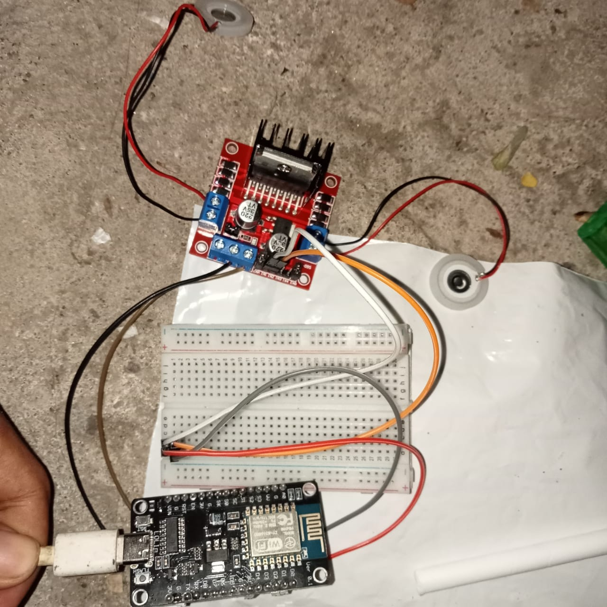

# SerenBox

- [SerenBox](#serenbox)
  - [Background](#background)
  - [Hardware](#hardware)
  - [Logic Flow](#logic-flow)
  - [Prototype Problems \& Solutions](#prototype-problems--solutions)
  - [Demo](#demo)
  - [Replication](#replication)
  - [Members Contributions](#members-contributions)

## Background

Most smart diffusers in the market still needs to be configured manually, even if they can be connected through an app.
Not only that, they can only provide 1 slot for essential oils.

Configuring them manually can be a hastle and changing oils in the middle of a diffusion session is not as quick as it could be. To help alleviate these problems, we prototyped SerenBox: a smart diffuser that can be configured based on the user’s emotions.

SerenBox is a smart diffuser with 2 essential oils slots that can be managed through our [SerenApp](https://github.com/Serena-Smart-Home-Smart-Wellbeing/serena-android-app)
and can automatically adjust itself based on the user's 7 emotions that is analyzed by our [Serena Emotion Detector model](https://github.com/Serena-Smart-Home-Smart-Wellbeing/serena-emotion-detector).
The 2 slots contains an A slot for energetic oils (e.g. Citronella Oil) and B slot for relaxing oils (e.g. Cajuput Oil).
SerenBox can be activated by running sessions through the app. Based on those configurations and the user's emotions, SerenBox will automatically toggle either one of the two essential oils the user placed in the SerenBox.

## Hardware

SerenBox is controlled by NodeMCU ESP8266 microcontroller. We use Arduino sketch to code our SerenBox which you can see in the [serena-serenbox.ino](sketch/serena-serenbox.ino).
The code will control 2 ultrasonic mist makers, which we use to diffuse 2 essential oils.
IC (Integrated Circuit) CD74HC4051E is used to connect from ESP8266 to the mist makers.
We use other components such as resistors and jumper wires to connect the components together.
We built the prototype on a breadboard to make changing the components easier during the development process. Below is the picture of our hardware prototype.

## Logic Flow

The diagram above explains how SerenApp and SerenBox work together through our backend. When a diffusion session is running, SerenApp
will periodically analyze the user's emotions using our model. Based on the results, it's going to toggle the SerenBox's mist makers
state in our database. Then, SerenBox will periodically fetch the mist makers state from our database and toggle the mist makers based on the state.

This solution allows us to have a decoupled system where SerenApp and SerenBox can work independently from each other. SerenBox only cares about
reading data from the database and toggling the mist makers based on the data, while SerenApp only cares about changing that data based on the user's emotions.
This decoupled design allows better scalability, maintainability, and performance.

To understand how SerenApp chooses which mist maker to toggle, refer to our [SerenApp documentations](https://github.com/Serena-Smart-Home-Smart-Wellbeing/serena-android-app)
.

## Prototype Problems & Solutions

Even though we've successfully built the hardware prototype of SerenBox, unfortunately we weren't able to finish a demo-ready hardware and code
for this capstone since we faced some problems along the way.

During the earlier capstone periods, we actually had designed and built the first version of our SerenBox prototype which you can see below.

The V1 took a couple of weeks since only one member was working on it and he was new to using ultrasonic mist makers. After building it, the V1 worked,
as in the code ran and the ESP8266 was able to fetch data from our backend; and each mist maker was able to be toggled independently.
The problem with V1 was that the mist makers were releasing small amounts of mist.
We thought this was because of the mist makers not getting enough power, so we tried thinking of a new soluton as well as designing a cover for the SerenBox.

But on Saturday, 16 December 2023, our device broke when we were testing it. Our diffuser container that has water spilled
and the water went into the ESP8266 and other components. It caused our device to short circuit since the mist maker didn't work
anymore and there were static sounds coming from the ESP8266. The ESP8266 lights were very dim too.

So we had no choice but to build a new one. Since we had thought of the upgrades for V2 to solve the mist makers not diffusing enough mist, we decided to build V2 instead.
Since the member that was working on this had ran out of components, he had to wait a few days for new components to arrive such as new mist makers and a new ESP8266.
Once it arrived, building it took a couple of days and it was finished on Wednesday, 20 December 2023. Since we planned to record our presentation on Thursday, 21 December 2023,
we didn't have time to create the new code for it, so unfortunately we aren't able to test the V2 connection with our backend. Although, in theory our
SerenBox V2 should work, we just need to create the code for it and test it; which we didn't have time to do.

Since we didn't have a hardware that is ready for demo for this capstone presentation, we decided to demo our code using Wokwi and
create a demo website to simulate how our SerenBox would work in real life. Creating this demo was possible to do in a short amount of time since
we had another member who was done with all of his tasks and had experience making websites, so he was able to help finish the demo in time.
The demo is explained in the [Demo](#demo) section below.

## Demo

We created 2 demonstrations for our SerenBox. These demos allows you to try out our SerenBox without having to build the hardware.

1. [SerenBox Demo Website](https://serena-smart-home-smart-wellbeing.github.io/serena-serenbox/).  
This website is to showcase how our SerenBox would work in real life. It simulates how the user would configure their SerenBox through our SerenApp and
how our app would periodically send the user's image to the model to be analyzed. It also explains how the SerenBox would toggle the mist makers based on the user's emotions and configurations.
2. [Wokwi SerenBox V1 Demo](https://wokwi.com/projects/384374647759420417).  
This Wokwi project is to showcase our V1 Arduino sketch. It uses ESP32 since Wokwi doesn't have ESP8266, but the code is the same with the difference being
the pin numbers and the libraries.

## Replication

If you want to try out our code, you could upload the code in [serena-serenbox.ino](sketch/serena-serenbox.ino) to your ESP8266 and see the logs through the serial monitor.
You can take an extra step further by building your own hardware by following our schematics that we've shown in the [Hardware](#hardware) section above.

## Members Contributions

|              Name              |    Student ID    |                                                                                                                  Contribution                                                                                                                  |
|------------------------------|----------------|----------------------------------------------------------------------------------------------------------------------------------------------------------------------------------------------------------------------------------------------|
|      Widiyanto      | (CC) C283BSY4002 | Designed SerenBox schematics. Built SerenBox prototype hardware. Code SerenBox. |
|      Muhammad Reyhan Ardiya Putra Wijaya      | (CC) C200BSY3485 | Helped writing HTTP requests in Arduino sketch. Create demo website. |
